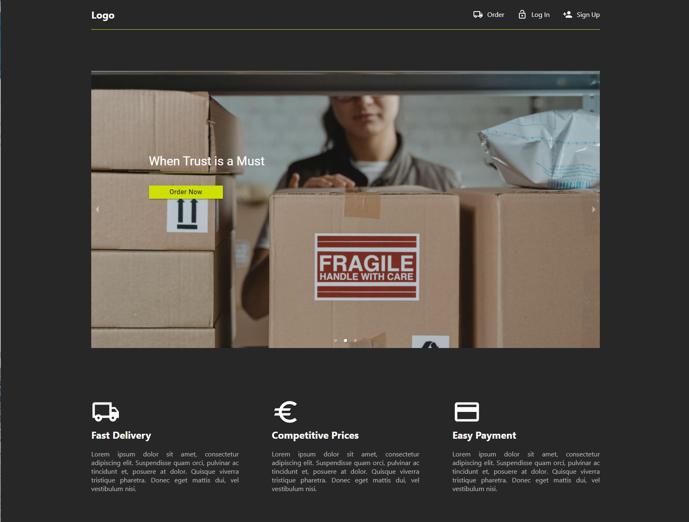
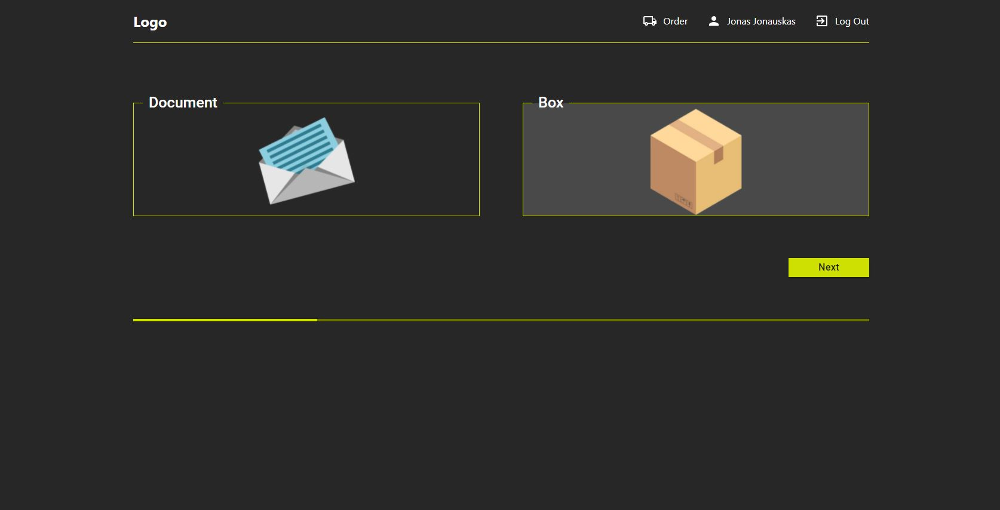
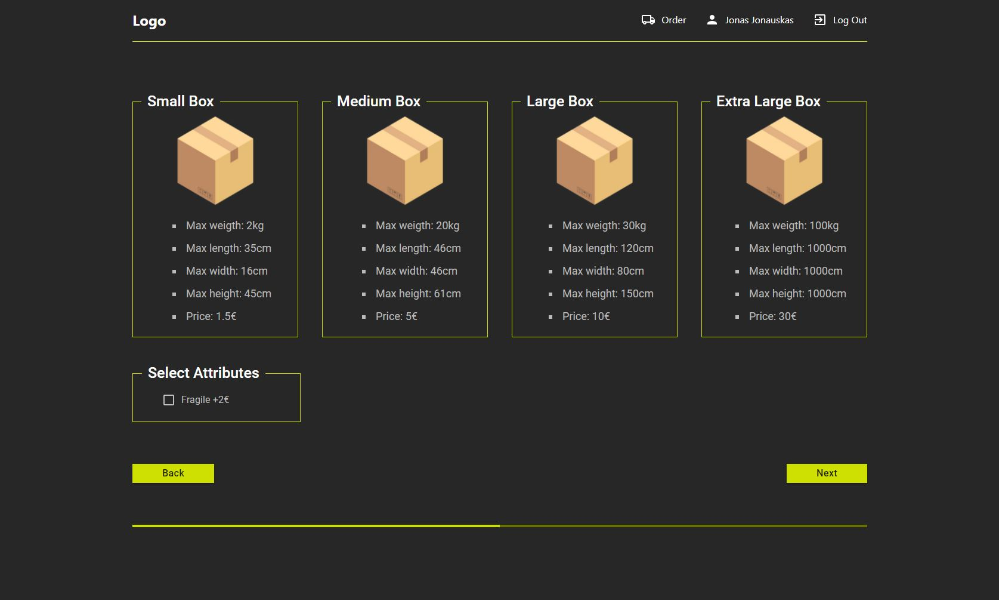
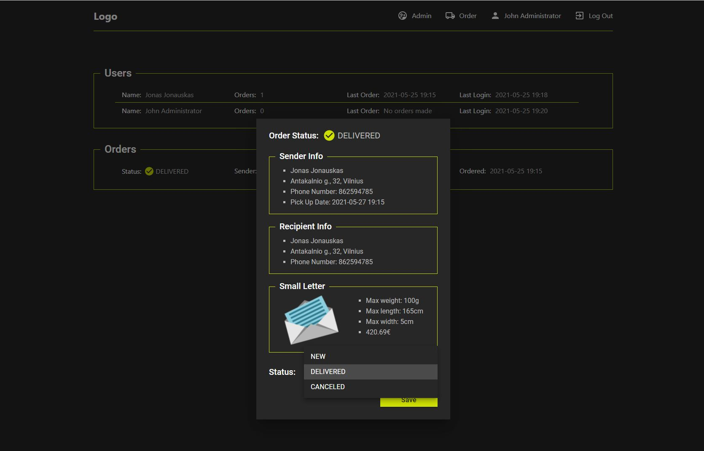
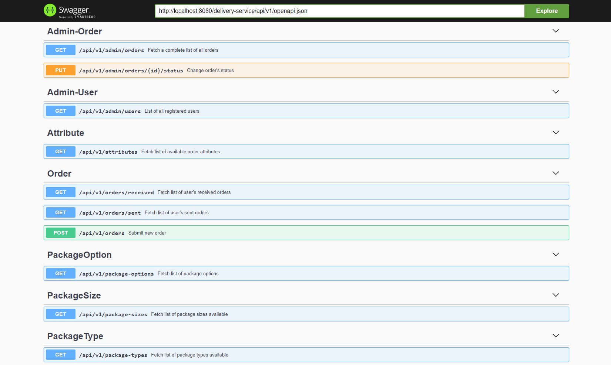

# Delivery Service

This repo contains REST API backend and React frontend for parcel delivery service.

# Screenshots 

---

##### Home screen

##### Different parcel types

##### Multiple package sizes

##### Minimal admin dashboard

##### Swagger API docs for developers

# Run the project

1. Run REST API locally as JBoss project in IntelliJ IDEA.
2. Launch frontend `cd ui && yarn install && yarn start`.

- The backend runs at: http://localhost:8080/delivery-service/api/v1
- The frontend runs at http://localhost:3000
- Access Swagger doc at http://localhost:8080/delivery-service/api/v1/api-doc

##### Demo user credentials

Regular user:
- jonas@gmail.com: password

Admin user:
- admin@delivery.com: password

---

# Technical details

##### GitHub workflow
1. Clone this repo to your machine
2. `cd` into repository and `git checkout develop`
3. Create new branch for your feature, e.g. `git checkout -b DDD-14-Implement-ui`
4. After done with your work, push your local branch to remote, e.g. `git push -u origin DDD-14-Implement-ui`
5. Create pull request from your branch into `develop`
6. Done.
